# Spec CLI (MCP)

[](https://www.npmjs.com/package/mcp-spec-cli)
[](https://opensource.org/licenses/MIT)
[](https://modelcontextprotocol.com)

[English](README.md) | [简体中文](README-zh.md)

**Spec CLI** 是一个具备状态感知的 Model Context Protocol (MCP) 服务，它能将您的 AI 代理转变为一个以规格说明驱动的产品工程师。它提供了一个稳健、零配置（zero-shot）且“开箱即用”的工作流，引导 AI 系统地从**需求分析 → 架构设计 → 任务拆解**移动，同时最大限度地减少 Token 使用量并提升自主性。

## 为什么选择 Spec CLI？

传统的 AI 编程通常会导致上下文丢失、实现偏离目标以及需求被遗忘。`mcp-spec-cli` (通常简写为 `spec`) 通过以下方式解决了这些问题：

*   **状态感知与自动驾驶：** 工具确切知道项目当前所处的阶段。AI 不需要自行跟踪目前是在进行“需求分析”还是“架构设计”——只需调用 `spec sc_plan`，工具会自动处理状态切换。
*   **歧义解决循环：** 在请求批准之前，AI 会被指示进行彻底的自查。它会识别不确定性，尽可能独立解决，并针对剩余问题提出针对性提问，确保在进入下一阶段前建立高质量的基准。
*   **强制性自评：** 新的 `spec sc_analyze` 工具提供了特定阶段的自我批评提示。工作流现在**要求** AI 调用 `spec sc_analyze` 在寻求用户批准之前对歧义、边缘情况和技术风险进行彻底审查。
*   **强制自查清单：** `spec sc_guidance` 工具提供了阶段特定的自查清单（例如：“检查设计中的循环依赖”，“确保所有验收标准都有对应的任务”）。工作流现在**要求** AI 调用 `spec sc_guidance` 并解决 Epoch 上下文中的所有 `openQuestions`，然后才能批准某个阶段。
*   **批准与反馈的区别：** 工作流包含一个显式的 `spec sc_feedback` 工具，用于记录用户的回答和反馈。这会自动清除“开放性问题”，并在调用 `spec sc_approve` 之前强制执行一个“冷静期”，防止模型将简单的回答误解为最终批准。
*   **一键式与逐步式模式：** 用户可以在**逐步式**（默认的“询问 -> 批准 -> 确认”循环）和**一键式**模式之间切换。在一键式模式下，AI 遵循与逐步式相同的严谨流程（包括强制性的指南检查、歧义解决和详细的任务文档），但完全自主执行。它使用其最佳判断解决歧义，并推进所有阶段——包括执行自动化测试和存档项目——而无需停止请求人工批准。
*   **生命周期目录管理：** 自动将工作组织到 `projects/active/` 和 `projects/completed/` 中。一旦工作流完成（或手动存档），工具会将整个功能文件夹移动到已完成目录中。
*   **自动化指令注入：** 自动将特定阶段的工程约束（需求、设计、任务）直接注入工作流，确保 AI 遵循指定的严谨性。
*   **智能任务组织：** 在初步编写任务文档后，工具会执行“刷新”步骤。它会组织具有明确依赖关系的任务，建立合理的执行顺序，并添加指向需求和设计文档的交叉引用注释。
*   **持久的任务周期记忆：** 一个“短期记忆”系统 (`.epoch-context.md`)，通过 `spec sc_epoch` 跟踪当前焦点、待办意图和假设。这确保了如果 AI 会话中断或关闭，下一个会话可以完美恢复上下文。
*   **"GPS" 导航系统：** 在每次工具调用结束时，`mcp-spec-cli` 会输出明确的“下一步”指令。这种机制让工具变成了自动导航的 GPS，极大地减少了对冗长系统提示词的依赖。可访问 `spec sc_guidance` 工具获取详细行为指令。
*   **显式批准门：** 为防止过早实施，工作流包含一个显式的 `spec sc_approve` 步骤。在 AI 完成草案（需求、设计或任务）后，它会进入 **Reviewing** 状态。在逐步式模式下，它必须解决歧义并在调用 `spec sc_approve` 之前获得批准。只有获得批准后，才能使用 `spec sc_plan` 生成下一阶段的模板。
*   **基于 Lexer 的可靠性：** 使用稳健的 Markdown 词法分析器（由 `marked` 驱动）代替脆弱的正则表达式来解析和手术级更新文档。这确保了任务复选框被准确更新，而不会破坏其他格式。

## 工作流图表

```mermaid
stateDiagram-v2
    direction TB

    state "阶段 1: 需求分析" as REQ {
        [*] --> 初始化需求: sc_init
        初始化需求 --> 编辑需求: AI 草拟与更新
        编辑需求 --> 歧义循环: 解决不确定性
        歧义循环 --> 询问用户: "看起来可以吗？"
        询问用户 --> 确认需求: 用户批准
        确认需求 --> [*]: sc_plan
    }

    state "阶段 2: 架构设计" as DES {
        [*] --> 生成设计支架: 重置周期上下文
        生成设计支架 --> 研究: AI 研究与草拟
        研究 --> 歧义循环设计: 解决不确定性
        歧义循环设计 --> 询问用户设计: "看起来可以吗？"
        询问用户设计 --> 确认设计: 用户批准
        确认设计 --> [*]: sc_plan
    }

    state "阶段 3: 实施计划" as TSK {
        [*] --> 生成任务支架: 重置周期上下文
        生成任务支架 --> 刷新任务: 添加依赖与引用
        刷新任务 --> 询问用户任务: "看起来可以吗？"
        询问用户任务 --> 确认任务: 用户批准
        确认任务 --> [*]: sc_plan
    }

    state "阶段 4: 实施" as IMP {
        [*] --> 开始任务: sc_todo_start
        开始任务 --> 编码: 编码与周期更新
        编码 --> 完成任务: sc_todo_complete
        完成任务 --> [*]: 所有任务已完成 [x]
    }

    state "阶段 5: 测试与验证" as TST {
        [*] --> 生成测试支架: sc_plan
        生成测试支架 --> 执行测试: AI/用户运行测试
        执行测试 --> 反馈: 记录结果/反馈
        反馈 --> 确认测试: 验证完成
        确认测试 --> 存档: sc_plan (已完成)
    }
    
    state Archive {
        [*] --> 移动至已完成: 移动到 projects/completed/
    }

    REQ --> DES
    DES --> TSK
    TSK --> IMP
    IMP --> TST
    TST --> [*]: 功能已验证并交付
```



## MCP 语义化工具

Spec CLI 提供了一套手术级的 MCP 工具，引导 AI 代理完成工作流。

| 工具名称 | 用途 | 示例参数 |
| :--- | :--- | :--- |
| `spec sc_init` | 在 `projects/active/` 中初始化新的功能规格说明。 | `{"name": "auth-system", "mode": "one-shot"}` |
| `spec sc_plan` | 推进工作流状态。完成后自动存档。 | `{"instruction": "使用 PostgreSQL"}` |
| `spec sc_approve` | 显式批准当前阶段。 | `{}` |
| `spec sc_analyze` | 执行专门的歧义分析。 | `{}` |
| `spec sc_guidance` | 获取详细的行为指令。 | `{}` |
| `spec sc_feedback` | 提供用户反馈或回答。 | `{"feedback": "Logo应该是蓝色的"}` |
| `spec sc_status` | 获取活动项目的健康检查和下一步指令。 | `{"feature": "auth-system"}` |
| `spec sc_todo_list` | 列出所有实施任务及其状态。 | `{}` |
| `spec sc_todo_start` | 将特定任务标记为正在进行。 | `{"id": "1.1"}` |
| `spec sc_todo_complete` | 将特定任务标记为已完成。 | `{"id": "1.1"}` |
| `spec sc_epoch` | 更新短期记忆的任务周期上下文。 | `{"focus": "实现认证"}` |
| `spec sc_mode` | 在 `one-shot` 和 `step-through` 之间切换项目模式。 | `{"mode": "one-shot"}` |
| `spec sc_archive` | 手动将项目移动到 `projects/completed/` 文件夹。 | `{}` |
| `spec sc_help` | 了解如何使用工具并获取深入文档。 | `{"topic": "sc_plan"}` |
| `spec sc_verify` | 用于验证上一步操作是否成功的专用工具。 | `{}` |
| `spec sc_refresh` | 强制刷新并同步内部工作流状态机。 | `{}` |

## 命令行界面

虽然主要通过 MCP 使用，但 Spec CLI 也提供了一个强大的独立命令行界面。

| 命令 | 描述 |
| :--- | :--- |
| `spec sc_init --name <name>` | 初始化新的功能规格说明。 |
| `spec sc_plan` | 推进工作流状态。 |
| `spec sc_approve` | 显式批准当前阶段。 |
| `spec sc_analyze` | 执行专门的歧义分析。 |
| `spec sc_guidance` | 获取详细的行为指令。 |
| `spec sc_feedback --feedback <text>` | 提供用户反馈或回答。 |
| `spec sc_todo_list` | 列出实施任务。 |
| `spec sc_epoch --focus <text>` | 更新短期记忆上下文。 |
| `spec sc_mode <mode>` | 在 'one-shot' 和 'step-through' 之间切换。 |
| `spec sc_archive` | 手动存档项目。 |
| `spec sc_status` | 获取活动项目的健康检查。 |
| `spec sc_verify` | 验证当前状态并检查一致性。 |
| `spec sc_help` | 显示帮助文档。 |

## 工作流特性

*   **生命周期隔离：** 通过自动将新功能放置在 `projects/active/` 并在完成后移动到 `projects/completed/` 来保持根目录整洁。
*   **稳健的路径解析：** 无论功能是在根目录、`projects/active/`、`projects/completed/`、`specs/` 还是 `docs/` 中，都能无缝找到。
*   **多行任务支持：** 对嵌套、多行实施任务进行高完整性解析，确保可靠跟踪复杂的编码步骤。

## 安装与设置

### 前置条件
* **Node.js**: 18.0.0 或更高版本。
* **包管理器**: npm, yarn 或 pnpm。

### 安装选项

#### 选项 1: 快速开始 (npx)
无需全局安装即可运行：
```bash
npx -y mcp-spec-cli@latest
```

#### 选项 2: 全局安装
作为独立的 CLI 频繁使用：
```bash
npm install -g mcp-spec-cli
```

#### 选项 3: MCP 客户端配置
要与 AI 助手一起使用，请将其添加到您的配置文件中：

**Claude Desktop**
添加到 `~/Library/Application Support/Claude/claude_desktop_config.json` (macOS) 或 `%APPDATA%\Claude\claude_desktop_config.json` (Windows):
```json
{
  "mcpServers": {
    "mcp-spec-cli": {
      "command": "npx",
      "args": ["-y", "mcp-spec-cli@latest"]
    }
  }
}
```

**Gemini CLI**
在 `~/.gemini/settings.json` 或本地的 `.gemini/settings.json` 中全局配置 `mcp-spec-cli`：
```json
{
  "mcpServers": {
    "mcp-spec-cli": {
      "command": "npx",
      "args": ["-y", "mcp-spec-cli@latest"]
    }
  }
}
```

**Claude Code**
```bash
claude mcp add mcp-spec-cli -s user -- npx -y mcp-spec-cli@latest
```

## 开发

### 开始使用

1.  **克隆仓库**:
    ```bash
    git clone https://github.com/benjamesmurray/mcp-spec-cli.git
    cd mcp-spec-cli
    ```
2.  **安装依赖**:
    ```bash
    npm install
    ```
3.  **构建项目**:
    ```bash
    npm run build
    ```
4.  **运行测试**:
    ```bash
    npm test
    ```

### 架构细节
该项目最近被重构为使用更易于维护的 **Repository/Service 模式**:
*   **`TaskLexer`**: 使用 `marked` 稳健地提取 Markdown 标记。
*   **`MarkdownTaskUpdater`**: 使用 Lexer 位置数据对手术级复选框进行更新。
*   **`TaskParser`**: 分层任务结构生成。
*   **Repositories**: 从 OpenAPI 规范派生的模板、工作流状态和指南数据的专用加载器。

## 许可证
MIT
