# Deliver CLI

[](https://www.npmjs.com/package/@epoch-ai/deliver-cli)
[](https://opensource.org/licenses/MIT)
[](https://modelcontextprotocol.com)

[English](README.md) | [简体中文](README-zh.md)

**Deliver CLI** is a senior-grade, state-aware Model Context Protocol (MCP) server that transforms your AI agent into a spec-driven product engineer. Version 3.0 (Agent-Optimized) is redesigned for high-density, low-token communication.

## Why Deliver CLI v3?

The traditional approach to AI coding often leads to scope creep and forgotten requirements. `deliver-cli` (v3) is optimized for senior AI agents:

*   **TOON Status Output (Context Efficiency):** `sc_status` now returns a compact, YAML-like format instead of verbose Markdown. This reduces token usage per turn by ~70%, keeping your context window lean.
*   **State-Aware Autopilot:** The tool knows exactly what stage the project is in. The AI doesn't have to track whether it's doing "Requirements" or "Design"—it just calls `mcpx spec sc_plan` and the tool handles the transition automatically.
*   **Zero-Overhead Execution:** Subprocesses have been eliminated; the MCP server invokes the CLI logic directly for maximum speed and reliable error handling.
*   **Minimalist Syntax:** Feature names and project identifiers are now optional. The tool defaults to the last-used project, reducing payload size for every subsequent tool call.
*   **One-Shot vs. Step-Through Modes:** Users can toggle between **Step-Through** (the default "Draft -> Approve -> Confirm" cycle) and **One-Shot** mode. In One-Shot mode, the AI progresses through all phases—including archiving the project—without stopping for human approval.
*   **Lifecycle Directory Management:** Automatically organizes work into `projects/active/` and `projects/completed/`.
*   **Persistent Task-Epoch Memory:** A "short-term memory" system (`.epoch-context.md`) that tracks active focus, pending intentions, and hypotheses via `mcpx spec sc_epoch`.
*   **The "GPS Breadcrumb" System:** At the end of every tool call, `deliver-cli` outputs an explicit "Next Step" directive.

## TOON Format (New in v3)

Instead of verbose Markdown, `mcpx spec sc_status` returns a compact block:

```yaml
spec_status:
  feature: code-analytics
  phase: requirements
  status: drafting
  next_step: write Requirements.md
  blockers: [template_tags_present]
  mode: one-shot
```

## Workflow Diagram

```mermaid
stateDiagram-v2
    direction TB

    state "Phase 1: Requirements (PRD)" as REQ {
        [*] --> InitReq: sc_init
        InitReq --> EditReq: AI Drafts
        EditReq --> ReviewReq: Remove tags
        ReviewReq --> ApproveReq: sc_approve
        ApproveReq --> [*]: sc_plan
    }

    state "Phase 2: Technical Design" as DES {
        [*] --> ScaffoldDes: Reset Epoch Context
        ScaffoldDes --> EditDes: AI Drafts
        EditDes --> ReviewDes: Remove tags
        ReviewDes --> ApproveDes: sc_approve
        ApproveDes --> [*]: sc_plan
    }

    state "Phase 3: Implementation Tasks" as TSK {
        [*] --> ScaffoldTasks: Reset Epoch Context
        ScaffoldTasks --> EditTsk: AI Drafts
        EditTsk --> ReviewTsk: Remove tags
        ReviewTsk --> ApproveTsk: sc_approve
        ApproveTsk --> [*]: sc_plan
    }

    state "Phase 4: Implementation" as IMP {
        [*] --> StartTask: sc_todo_start
        StartTask --> Work: Coding & Epoch Updates
        Work --> CompleteTask: sc_todo_complete
        CompleteTask --> [*]: All Tasks [x]
    }
    
    state Archive {
        [*] --> MoveToCompleted: sc_plan (Archive)
    }

    REQ --> DES
    DES --> TSK
    TSK --> IMP
    IMP --> Archive
    Archive --> [*]: Feature Delivered
```



## MCP Semantic Tools

Spec CLI provides a suite of surgical MCP tools to guide the AI agent through the workflow.

| Tool Name | Purpose | Example Arguments |
| :--- | :--- | :--- |
| `mcpx spec sc_init` | Initialize a new feature specification in `projects/active/`. | `{"name": "auth-system", "mode": "one-shot"}` |
| `mcpx spec sc_plan` | Progress the workflow state. Automatically archives when finished. | `{"instruction": "Use PostgreSQL"}` |
| `mcpx spec sc_approve` | Explicitly approve the current drafted phase after review. | `{}` |
| `mcpx spec sc_feedback` | Provide user feedback or answers to questions. | `{"feedback": "The logo should be blue"}` |
| `mcpx spec sc_status` | Get a health check of the active project and snappy next steps. | `{"feature": "auth-system"}` |
| `mcpx spec sc_todo_list` | List all implementation tasks and their status. | `{}` |
| `mcpx spec sc_todo_start` | Mark a specific task as being actively worked on. | `{"id": "1.1"}` |
| `mcpx spec sc_todo_complete` | Mark a specific task as completed. | `{"id": "1.1"}` |
| `mcpx spec sc_epoch` | Update the task-epoch context for short-term memory. | `{"focus": "implement auth"}` |
| `mcpx spec sc_mode` | Toggle project mode between `one-shot` and `step-through`. | `{"mode": "one-shot"}` |
| `mcpx spec sc_archive` | Manually move the project to the `projects/completed/` folder. | `{}` |
| `mcpx spec sc_help` | Learn how to use the tools and get deep documentation. | `{"topic": "sc_plan"}` |
| `mcpx spec sc_verify` | A dedicated tool to validate that the last action worked. | `{}` |
| `mcpx spec sc_refresh` | Force a refresh and synchronization of the internal workflow state machine. | `{}` |

## Command Line Interface

While primarily used via MCP, Spec CLI also provides a powerful standalone interface.

| Command | Description |
| :--- | :--- |
| `mcpx spec sc_init --name <name>` | Initialize a new feature specification. |
| `mcpx spec sc_plan` | Progress the workflow state. |
| `mcpx spec sc_approve` | Explicitly approve the current phase. |
| `mcpx spec sc_feedback --feedback <text>` | Provide user feedback or answers. |
| `mcpx spec sc_todo_list` | List implementation tasks. |
| `mcpx spec sc_epoch --focus <text>` | Update short-term memory context. |
| `mcpx spec sc_mode <mode>` | Toggle between 'one-shot' and 'step-through'. |
| `mcpx spec sc_archive` | Manually archive the project. |
| `mcpx spec sc_status` | Get a health check of the active project. |
| `mcpx spec sc_verify` | Verify current state and check consistency. |
| `mcpx spec sc_help` | Show help documentation. |

## Installation & Setup

### Prerequisites
* **Node.js**: Version 18.0.0 or higher.
* **Package Manager**: npm, yarn, or pnpm.

### Installation Options

#### Option 1: Quick Start (npx)
Run it without installing globally:
```bash
npx -y @epoch-ai/deliver-cli
```

#### Option 2: Global Installation
For frequent use as a standalone CLI:
```bash
npm install -g @epoch-ai/deliver-cli
```

#### Option 3: MCP Client Configuration
To use this with AI assistants, add it to your configuration file:

**Claude Desktop**
Add to `~/Library/Application Support/Claude/claude_desktop_config.json` (macOS) or `%APPDATA%\Claude\claude_desktop_config.json` (Windows):
```json
{
  "mcpServers": {
    "deliver-cli": {
      "command": "npx",
      "args": ["-y", "@epoch-ai/deliver-cli"]
    }
  }
}
```

**Gemini CLI**
Configure `deliver-cli` globally in `~/.gemini/settings.json` or locally in `.gemini/settings.json`:
```json
{
  "mcpServers": {
    "deliver-cli": {
      "command": "npx",
      "args": ["-y", "@epoch-ai/deliver-cli"]
    }
  }
}
```

**Claude Code**
```bash
claude mcp add deliver-cli -s user -- npx -y @epoch-ai/deliver-cli
```

## Development

### Getting Started

1.  **Clone the Repo**:
    ```bash
    git clone https://github.com/benjamesmurray/deliver-cli.git
    cd deliver-cli
    ```
2.  **Install Dependencies**:
    ```bash
    npm install
    ```
3.  **Build the Project**:
    ```bash
    npm run build
    ```
4.  **Run Tests**:
    ```bash
    npm test
    ```

## License
MIT
