# Spec CLI (MCP)

[](https://www.npmjs.com/package/mcp-spec-cli)
[](https://opensource.org/licenses/MIT)
[](https://modelcontextprotocol.com)

[English](README.md) | [简体中文](README-zh.md)

**Spec CLI** is a state-aware Model Context Protocol (MCP) server that transforms your AI agent into a spec-driven product engineer. It provides a robust, zero-shot "just works" workflow that guides AI to systematically move from **Requirements → Design → Tasks** with minimal token usage and maximum autonomy.

## Why Spec CLI?

The traditional approach to AI coding often leads to scope creep and forgotten requirements. `mcp-spec-cli` (often aliased as `spec`) fixes this by providing:

*   **State-Aware Autopilot:** The tool knows exactly what stage the project is in. The AI doesn't have to track whether it's doing "Requirements" or "Design"—it just calls `spec sc_plan` and the tool handles the transition automatically.
*   **Ambiguity Resolution Loop:** Before asking for approval, the AI is instructed to perform a thorough self-review. It identifies uncertainties, resolves what it can independently, and asks targeted questions for the rest, ensuring a high-quality baseline before moving to the next phase.
*   **Mandatory Self-Critique:** The new `spec sc_analyze` tool provides a dedicated stage-specific critique prompt. The workflow now **mandates** that the AI calls `spec sc_analyze` to perform a thorough review for ambiguities, edge cases, and technical risks before it can seek user approval.
*   **Enforced Self-Review Checklists:** The `spec sc_guidance` tool provides phase-specific self-review checklists (e.g., "Check for circular dependencies in Design," "Ensure all acceptance criteria have tasks"). The workflow now **mandates** that the AI calls `spec sc_guidance` and resolves all `openQuestions` in the epoch context before it can approve a phase.
*   **Approval & Feedback Distinction:** The workflow includes an explicit `spec sc_feedback` tool for recording user answers and feedback. This automatically clears "open questions" and enforces a "cooling-off" period before `spec sc_approve` can be called, preventing the model from misinterpreting simple answers as final approval.
*   **One-Shot vs. Step-Through Modes:** Users can toggle between **Step-Through** (the default "Ask -> Approve -> Confirm" cycle) and **One-Shot** mode. In One-Shot mode, the AI follows the same rigorous process as Step-Through (including mandatory guidance checks, ambiguity resolution, and detailed task documentation) but performs them fully autonomously. It resolves ambiguities using its best judgment and progresses through all phases—including executing automated tests and archiving the project—without stopping for human approval.
*   **Lifecycle Directory Management:** Automatically organizes work into `projects/active/` and `projects/completed/`. Once a workflow is finalized (or manually archived), the tool moves the entire feature folder to the completed directory.
*   **Automated Guidance Injection:** Automatically injects phase-specific engineering constraints (Requirements, Design, Tasks) directly into the workflow, ensuring the AI adheres to the specified rigour.
*   **Intelligent Task Organization:** After the initial task document is written, the tool performs a "refresh" step. It organizes tasks with clear dependencies, establishes a sensible execution order, and annotates them with cross-references to the requirements and design documents.
*   **Persistent Task-Epoch Memory:** A "short-term memory" system (`.epoch-context.md`) that tracks active focus, pending intentions, and hypotheses via `spec sc_epoch`. This ensures that if an AI session is interrupted or closed, the next session resumes with perfect context.
*   **The "GPS Breadcrumb" System:** At the end of every tool call, `mcp-spec-cli` outputs an explicit "Next Step" directive. This turns the tool into an autonomous GPS, heavily reducing the need for lengthy system prompts. To keep the status output clean, verbose behavioral instructions (like the "Ambiguity Resolution Loop") are accessible via the `spec sc_guidance` tool.
*   **Explicit Approval Gates:** To prevent premature implementation, the workflow includes an explicit `spec sc_approve` step. After the AI completes a draft (Requirements, Design, or Tasks), it enters a **Reviewing** state. In Step-Through mode, it must resolve ambiguities and receive approval before calling `spec sc_approve`. Only once approved can `spec sc_plan` be used to scaffold the next phase.
*   **Lexer-Guided Reliability:** Uses a robust Markdown lexer (powered by `marked`) instead of fragile Regular Expressions to parse and surgically update documents. This ensures task checkboxes are updated accurately without corrupting other formatting.

## Workflow Diagram

```mermaid
stateDiagram-v2
    direction TB

    state "Phase 1: Requirements" as REQ {
        [*] --> InitReq: sc_init
        InitReq --> EditReq: AI Drafts (Pending Edits)
        EditReq --> ReviewReq: Remove tags (Reviewing)
        ReviewReq --> AnalyzeReq: sc_analyze (Critique)
        AnalyzeReq --> GuidanceReq: sc_guidance (Ambiguity Loop)
        GuidanceReq --> FeedbackReq: sc_feedback (Answers)
        FeedbackReq --> ApproveReq: sc_approve
        ApproveReq --> [*]: sc_plan
    }

    state "Phase 2: Design" as DES {
        [*] --> ScaffoldDes: Reset Epoch Context
        ScaffoldDes --> Research: AI Drafts (Pending Edits)
        Research --> ReviewDes: Remove tags (Reviewing)
        ReviewDes --> AnalyzeDes: sc_analyze (Critique)
        AnalyzeDes --> GuidanceDes: sc_guidance (Ambiguity Loop)
        GuidanceDes --> FeedbackDes: sc_feedback (Answers)
        FeedbackDes --> ApproveDes: sc_approve
        ApproveDes --> [*]: sc_plan
    }

    state "Phase 3: Implementation Planning" as TSK {
        [*] --> ScaffoldTasks: Reset Epoch Context
        ScaffoldTasks --> RefreshTasks: AI Drafts (Pending Edits)
        RefreshTasks --> ReviewTsk: Remove tags (Reviewing)
        ReviewTsk --> AnalyzeTsk: sc_analyze (Critique)
        AnalyzeTsk --> GuidanceTsk: sc_guidance (Ambiguity Loop)
        GuidanceTsk --> FeedbackTsk: sc_feedback (Answers)
        FeedbackTsk --> ApproveTsk: sc_approve
        ApproveTsk --> [*]: sc_plan
    }

    state "Phase 4: Implementation" as IMP {
        [*] --> StartTask: sc_todo_start
        StartTask --> Work: Coding & Epoch Updates
        Work --> CompleteTask: sc_todo_complete
        CompleteTask --> [*]: All Tasks [x]
    }

    state "Phase 5: Testing & Verification" as TST {
        [*] --> ScaffoldTest: sc_plan
        ScaffoldTest --> ReviewTst: Remove tags (Reviewing)
        ReviewTst --> GuidanceTst: sc_guidance
        GuidanceTst --> ApproveTst: sc_approve
        ApproveTst --> Archive: sc_plan (Finished)
    }
    
    state Archive {
        [*] --> MoveToCompleted: Move to projects/completed/
    }

    REQ --> DES
    DES --> TSK
    TSK --> IMP
    IMP --> TST
    TST --> [*]: Feature Verified & Delivered
```



## MCP Semantic Tools

Spec CLI provides a suite of surgical MCP tools to guide the AI agent through the workflow.

| Tool Name | Purpose | Example Arguments |
| :--- | :--- | :--- |
| `spec sc_init` | Initialize a new feature specification in `projects/active/`. | `{"name": "auth-system", "mode": "one-shot"}` |
| `spec sc_plan` | Progress the workflow state. Automatically archives when finished. | `{"instruction": "Use PostgreSQL"}` |
| `spec sc_approve` | Explicitly approve the current drafted phase after review. | `{}` |
| `spec sc_analyze` | Perform a dedicated ambiguity analysis and self-critique. | `{}` |
| `spec sc_guidance` | Get detailed behavioral instructions for the current state. | `{}` |
| `spec sc_feedback` | Provide user feedback or answers to open questions. | `{"feedback": "The logo should be blue"}` |
| `spec sc_status` | Get a health check of the active project and snappy next steps. | `{"feature": "auth-system"}` |
| `spec sc_todo_list` | List all implementation tasks and their status. | `{}` |
| `spec sc_todo_start` | Mark a specific task as being actively worked on. | `{"id": "1.1"}` |
| `spec sc_todo_complete` | Mark a specific task as completed. | `{"id": "1.1"}` |
| `spec sc_epoch` | Update the task-epoch context for short-term memory. | `{"focus": "implement auth"}` |
| `spec sc_mode` | Toggle project mode between `one-shot` and `step-through`. | `{"mode": "one-shot"}` |
| `spec sc_archive` | Manually move the project to the `projects/completed/` folder. | `{}` |
| `spec sc_help` | Learn how to use the tools and get deep documentation. | `{"topic": "sc_plan"}` |
| `spec sc_verify` | A dedicated tool to validate that the last action worked. | `{}` |
| `spec sc_refresh` | Force a refresh and synchronization of the internal workflow state machine. | `{}` |

## Command Line Interface

While primarily used via MCP, Spec CLI also provides a powerful standalone interface.

| Command | Description |
| :--- | :--- |
| `spec sc_init --name <name>` | Initialize a new feature specification. |
| `spec sc_plan` | Progress the workflow state. |
| `spec sc_approve` | Explicitly approve the current phase. |
| `spec sc_analyze` | Perform a dedicated ambiguity analysis. |
| `spec sc_guidance` | Get detailed behavioral instructions. |
| `spec sc_feedback --feedback <text>` | Provide user feedback or answers. |
| `spec sc_todo_list` | List implementation tasks. |
| `spec sc_epoch --focus <text>` | Update short-term memory context. |
| `spec sc_mode <mode>` | Toggle between 'one-shot' and 'step-through'. |
| `spec sc_archive` | Manually archive the project. |
| `spec sc_status` | Get a health check of the active project. |
| `spec sc_verify` | Verify current state and check consistency. |
| `spec sc_help` | Show help documentation. |

## Workflow Features

*   **Lifecycle Isolation:** Keeps the root directory clean by automatically placing new features in `projects/active/` and moving them to `projects/completed/` when finished.
*   **Robust Path Resolution:** Seamlessly finds features whether they are in the root, `projects/active/`, `projects/completed/`, `specs/`, or `docs/`.
*   **Multi-line Task Support:** High-integrity parsing of nested, multi-line implementation tasks, ensuring reliable tracking of complex coding steps.

## Installation & Setup

### Prerequisites
* **Node.js**: Version 18.0.0 or higher.
* **Package Manager**: npm, yarn, or pnpm.

### Installation Options

#### Option 1: Quick Start (npx)
Run it without installing globally:
```bash
npx -y mcp-spec-cli@latest
```

#### Option 2: Global Installation
For frequent use as a standalone CLI:
```bash
npm install -g mcp-spec-cli
```

#### Option 3: MCP Client Configuration
To use this with AI assistants, add it to your configuration file:

**Claude Desktop**
Add to `~/Library/Application Support/Claude/claude_desktop_config.json` (macOS) or `%APPDATA%\Claude\claude_desktop_config.json` (Windows):
```json
{
  "mcpServers": {
    "mcp-spec-cli": {
      "command": "npx",
      "args": ["-y", "mcp-spec-cli@latest"]
    }
  }
}
```

**Gemini CLI**
Configure `mcp-spec-cli` globally in `~/.gemini/settings.json` or locally in `.gemini/settings.json`:
```json
{
  "mcpServers": {
    "mcp-spec-cli": {
      "command": "npx",
      "args": ["-y", "mcp-spec-cli@latest"]
    }
  }
}
```

**Claude Code**
```bash
claude mcp add mcp-spec-cli -s user -- npx -y mcp-spec-cli@latest
```

## Development

### Getting Started

1.  **Clone the Repo**:
    ```bash
    git clone https://github.com/benjamesmurray/mcp-spec-cli.git
    cd mcp-spec-cli
    ```
2.  **Install Dependencies**:
    ```bash
    npm install
    ```
3.  **Build the Project**:
    ```bash
    npm run build
    ```
4.  **Run Tests**:
    ```bash
    npm test
    ```

### Architecture Details
The project has been recently refactored to use a more maintainable **Repository/Service pattern**:
*   **`TaskLexer`**: Robust Markdown token extraction using `marked`.
*   **`MarkdownTaskUpdater`**: Surgical checkbox updates using lexer position data.
*   **`TaskParser`**: Hierarchical task structure generation.
*   **Repositories**: Specialized loaders for Templates, Workflow State, and Guidance data derived from the OpenAPI spec.

## License
MIT
